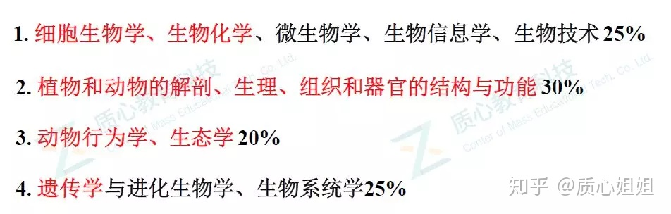
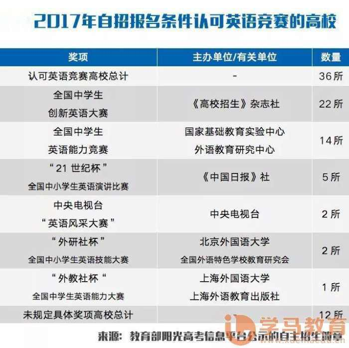
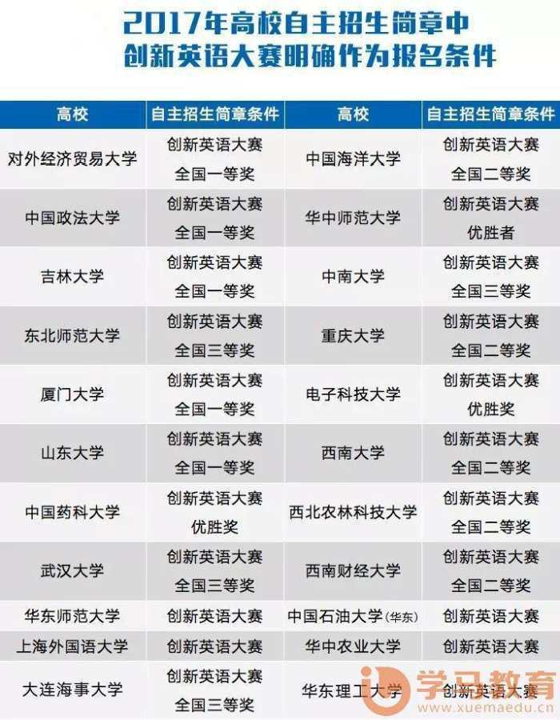
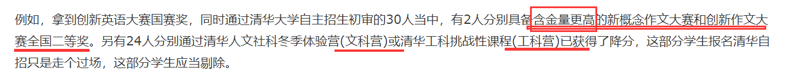
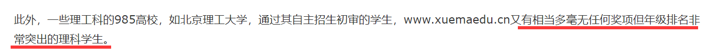

# NOIP
[获奖人数&省份分布](http://www.noip.org.cn/news/view.php?id=536&type=3)
[复赛上机题](http://www.noip.org.cn/news/view.php?id=1411)
C++编程，指令行调试
其中部分题目是大学专业课程水平，需要比赛前自学完成算法学、拓扑学、图论
[自主招生要求样例](http://www.noip.org.cn/news/view.php?id=1959)
[如何个人报名（其实还是要通过学校）](https://www.zhihu.com/question/65290786)

# 高中生物竞赛
[比赛划分（CHSBO/CNBO/IBO）](https://baike.baidu.com/item/%E7%94%9F%E7%89%A9%E7%AB%9E%E8%B5%9B/606930?fr=aladdin)
[准备范围（大学课程）](https://www.zhihu.com/question/265474236)

# 英语竞赛
[被高校认可的比赛](https://www.cnblogs.com/hjlweilong/p/9826367.html)

